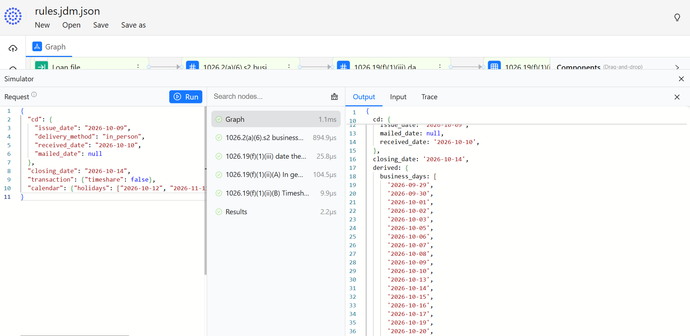
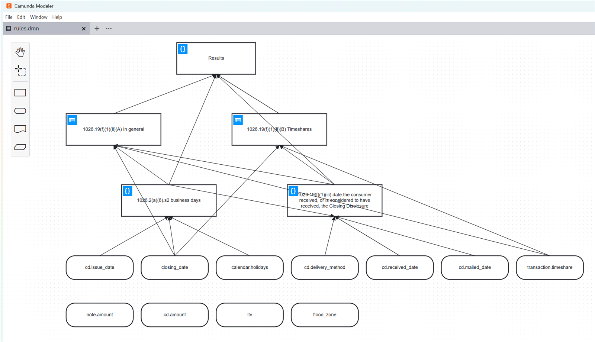

# reg-to-jdm-pack: GoRules JDM and Camunda DMN rule pack

A compiled rule pack for GoRules (JDM) and Camunda 8 (DMN), with its receipts, tests and verifier.

## What is in this repo

The pack, in `out/pack/`:

| File | Content |
| - | - |
| `rules.jdm.json` | The decision model in the GoRules JDM format. One expression node per derived value, one decision table per source paragraph; rows carry the rule id in `_id` and in a `rule_id` output column. Format: [docs/jdm-target.md](docs/jdm-target.md). |
| `rules.dmn` | The same decision model in DMN 1.3 for Camunda 8. One decision with a literal expression per derived value, one decision with a decision table per source paragraph (hit policy COLLECT); each rule carries the rule id in a `rule_id` output and in its description. Format: [docs/dmn-target.md](docs/dmn-target.md). |
| `receipts.json` | Rule id to sentence id, quote, source file and its SHA-256, and the rule's JDM rows and DMN rules. |
| `questions.yaml` | Open questions with their readings, and rules blocked by them. Empty: this pack is final. |
| `answers.yaml` | The decisions taken on the questions, with who answered. |
| `tests/` | One JSON per test case: input, expected output, rule id, note. Every rule has a passing and a failing case. |
| `readback.md` | Each row in plain English next to its source sentence; each DMN rule in the same words. |
| `changes.json` | Rule ids added, changed and retired against the first pass. |

Next to it: the source text in `sources/`, the vocabulary in `vocab/`, the hand-written test loans in `fixtures/` (their results are the `fixture-*.json` cases in `out/pack/tests/`), the verifier and the readback renderer in `src/reg_to_jdm/`.

Every claim in the pack can be checked here. `verify` loads the JDM into the ZEN engine, runs the sixteen test cases, compares every quote with the eCFR text in `sources/` character for character, checks every number in a rule against its quote and every field and function against the vocabulary. `verify --target dmn` does the same with `rules.dmn` in Camunda's DMN engine, and `--target all` runs both; both give the same verdict on every test case. `readback` renders the plain-English readback again from the two models and the receipts.

## What is not in this repo

The compiler that produced the pack. It reads the text sentence by sentence and asks a model to write each sentence as a rule, a link, a question or not a rule. It checks each record with gates, feeds failures back to the model, and stops with a question when a sentence cannot be written without guessing. `validator.py` here holds the gates that run on the finished pack. The compiler is not published. The open questions of the first pass in [examples/trid-19f-first-pass/](examples/trid-19f-first-pass/questions.yaml) and the answers in `out/pack/answers.yaml` show what it produces.

## The worked example

12 CFR 1026.19(f)(1)(i) to (iii), the Closing Disclosure timing rule, with the definition of business day from 1026.2(a)(6), copied from the eCFR as of 2026-10-05. The test loans:

| Loan | Expected |
| - | - |
| Closing Disclosure received Friday 2026-10-16, consummation Monday 2026-10-19 | fail |
| Mailed Tuesday 2026-10-20, consummation Thursday 2026-10-22 | fail |
| Received Thursday 2026-10-15, consummation Monday 2026-10-19 (Saturday is a business day under 1026.19(f)) | pass |
| Received Saturday 2026-10-10, consummation Wednesday 2026-10-14, Columbus Day in between | fail |
| Timeshare, received Friday, consummation Monday, under 1026.19(f)(1)(ii)(B) | pass |

The GoRules expression language has no business-day or holiday function. The first pass raised that as a question on 1026.2(a)(6), with two others: the scope references of (f)(1)(i) and the (f)(2) exceptions of (f)(1)(ii)(A). All three were answered (see `answers.yaml`). The loan file now carries `calendar.holidays`, and business days are computed from it with documented functions only.

## Run it

```bash
uv sync
uv run reg-to-jdm verify --final --target all
uv run reg-to-jdm readback
uv run pytest
```

Load the JDM into zen-engine. The input is a nested object; the GoRules editor and all SDKs take nested objects, and flat keys such as `"cd.issue_date"` are not resolved.

```python
import zen
decision = zen.ZenEngine().create_decision(open("out/pack/rules.jdm.json").read())
loan = {"cd": {"issue_date": "2026-10-14", "delivery_method": "in_person", "received_date": "2026-10-16", "mailed_date": None},
        "closing_date": "2026-10-19", "transaction": {"timeshare": False}, "calendar": {"holidays": ["2026-10-12"]}}
print(decision.evaluate(loan)["result"]["results"])
```

This prints a `fail` for `1026.19(f)(1)(ii)(A)/r1` and an empty list for the timeshare table.

### Open in the GoRules editor

1. Open https://editor.gorules.io and open `out/pack/rules.jdm.json`.
2. Open the simulator and paste the `input` object of a fixture, for example `fixtures/trid-19f/cd-received-saturday-closing-after-columbus-day.json`.
3. Run. All nodes evaluate. For the Columbus Day fixture the result has `derived.cd_receipt_date` `"2026-10-10"`, `results.s1026_19_f_1_ii_A` `[{"rule_id": "1026.19(f)(1)(ii)(A)/r1", "result": "fail"}]`. The timeshare table matches no row; the editor leaves its key out of `results`, where the Python SDK returns an empty list.



*editor.gorules.io, 2026-10-08: the Columbus Day fixture. Every node evaluated. The output shows the receipt date 2026-10-10 and a fail from rule 1026.19(f)(1)(ii)(A)/r1.*

### Open in Camunda Modeler

1. Install the [Camunda Desktop Modeler](https://camunda.com/download/modeler/) (free) and open `out/pack/rules.dmn`. It opens as a Camunda 8 diagram, with no import warnings.
2. The requirements graph shows the loan file fields at the bottom, the two derived values (business days, the receipt date of the Closing Disclosure) above them, one decision table per paragraph, and a `Results` decision that gathers them. Click the table icon of a decision to see its rules: an "Applies when" and a "Requirement met" column of FEEL conditions, and the rule id and `pass` or `fail` as outputs.
3. To run it, deploy it to Camunda 8. With a local [Camunda 8 Run](https://docs.camunda.io/docs/self-managed/quickstart/developer-quickstart/c8run/) started, `uv run python scripts/camunda_run_check.py` deploys `rules.dmn` and evaluates the `results` decision for every test case through the REST API, next to the ZEN engine and the DMN engine of `verify`. On Camunda 8 Run 8.9.23 all sixteen agree ([NOTES.md](NOTES.md)). The input is the same nested loan file as for the JDM.



*Camunda Desktop Modeler 5.52.0, 2026-10-08: `rules.dmn` opened as a Camunda 8 diagram.*

`verify --target dmn` needs Java 21 and Maven: the verifier runs Camunda's DMN engine (dmn-scala 1.11.3 with feel-scala 1.21.1, the versions Camunda 8.9 ships) as a Java process from `runner/`, built on first use.

## Using this pack

The pack is Apache 2.0. Load it into any GoRules SDK or editor, or deploy `rules.dmn` to Camunda 8; add test cases to `out/pack/tests/` in the same format (`verify` runs every file there), and supply your own holiday list with each loan file in `calendar.holidays`. A rule changed by hand no longer matches its receipt, and `verify` reports it.

Known limits:

- The exceptions in 1026.19(f)(2)(i), (iii), (iv) and (v) are out of scope. The verdict is wrong for a loan file to which one of them applies.
- Coverage under 1026.19(e)(1)(i) and the content of the Closing Disclosure (1026.38) are not checked.
- For mailed and electronic delivery the three-business-day presumption of (f)(1)(iii) is applied even when the file records an earlier receipt.
- Business days are listed over a window from the issue date minus 10 days to consummation plus 10 days. The window is code, not text, and has no receipt.
- `closing_date` must be the date of consummation.

## Services

I compile other texts and build packs for other rule engines: see [SERVICES.md](SERVICES.md).
Contact: boristep@gmail.com.

## Background

The pack was built with the Compiled AI pattern: a model writes the artifact at compile time, gates decide whether it is written, and a deterministic runtime executes it with no model in the path ([Compiled AI: Engineering Deterministic LLM Systems](https://medium.com/itnext/compiled-ai-engineering-deterministic-llm-systems-f911558764d4)).

## License

Apache 2.0. The regulation text in `sources/` comes from the eCFR and is in the public domain.
